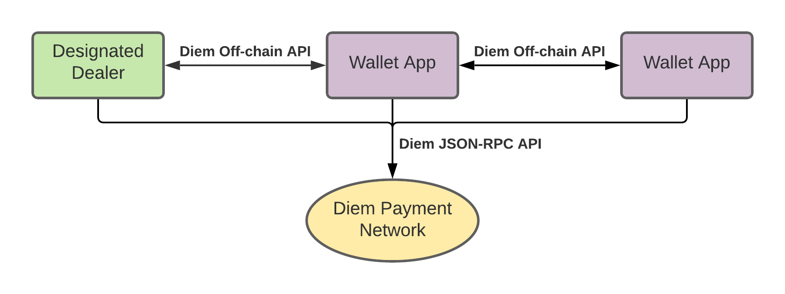

# Diem Client SDKs

Diem Client SDKs is a collection of libraries and tools for creating applications integrated with Diem Payment Network.
The goal of client SDK is to provide native language support for all aspects of integrations, communications, and protocols in the Diem ecosystem.

This codebase keeps track of [SDK feature specifications](specs) and status for Diem Client SDKs development.

| Module                             | [Python][l1]                                    | [Java][l2]                        | [Go][l3]                          | [Rust][l4]            | [TypeScript][l5]      | [C#][l6]          | [C++][l7]                                 |
|------------------------------------|-------------------------------------------------|-----------------------------------|-----------------------------------|-----------------------|-----------------|-------------|-------------------------------------|
| [BCS Runtime][1]                   | :sunny:                                         | :sunny:                           | :sunny:                           | :sunny:               | :partly\_sunny: ![joelmarcey] | :sunny: ![joelmarcey]    | :sunny:                             |
| [Transaction Builder Generator][2] | :sunny:                                         | :sunny:                           | :sunny:                           | :sunny:               | :snowflake: ![joelmarcey]    | :snowflake: ![joelmarcey] | :partly\_sunny:                     |
| [JSON-RPC Client][3]               | :partly\_sunny:                                 | :partly\_sunny:                   | :partly\_sunny:                   | :partly\_sunny:       | :partly\_sunny: | :snowflake: | :cloud\_with\_lightning\_and\_rain: |
| [Multisignature][4]                | :snowflake: [#202][p202]             | :snowflake: [#69][j69] | :sunny:                           | :sunny:               | :snowflake:     | :snowflake: | :snowflake:                         |
| [Off-chain][5]                     | :partly\_sunny: ![xli] ![yanivmo] ![martonmaya] | :snowflake: [#71][j71] | :snowflake: [#36][g36] | :snowflake:           | :snowflake:     | :snowflake: | :snowflake:                         |
| [Faucet Client][6]                 | :sunny:                                         | :partly\_sunny:                   | :partly\_sunny:                   | :snowflake:           | :partly\_sunny: | :snowflake: | :snowflake:                         |
| [Packaging][7]                     | :sunny:                                         | :sunny:                           | :sunny:                           | :cloud: ![bmwill]     | :snowflake:     | :snowflake: | :snowflake:                         |
| [Verifying Client][8]              | :ice\_cube: [#201][p201]             | :ice\_cube: [#68][j68] | :ice\_cube: [#38][g38] | :cloud: ![anomalroil] | :ice\_cube:     | :ice\_cube: | :ice\_cube:                         |
| [Mini Wallet][9]                   | :cloud: ![xli]                                  | :ice\_cube: [#70][j70] | :ice\_cube: [#37][g37] | :ice\_cube:           | :ice\_cube:     | :ice\_cube: | :ice\_cube:                         |

## JSON-RPC Client

| Feature                              | [Python][pjrc]  | [Java][jjrc]    | [Go][gjrc]      | [Rust][rjrc] | TypeScript  |
|--------------------------------------|-----------------|-----------------|-----------------|--------------|-------------|
| [JSON-RPC SPEC API][c1]              | :sunny:         | :sunny:         | :sunny:         | :sunny:      | :sunny:     |
| [Retry stale response error][c2]     | :partly\_sunny: | :partly\_sunny: | :partly\_sunny: | :sunny:      | :cloud:     |
| [Wait for transaction execution][c3] | :sunny:         | :sunny:         | :sunny:         | :sunny:      | :sunny:     |
| [Request strategy][c4]               | :sunny:         | :snowflake:     | :snowflake:     | :sunny:      | :snowflake: |
| [JSON-RPC Batch API][c5]             | :snowflake:     | :snowflake:     | :snowflake:     | :sunny:      | :snowflake: |
| [Off-chain resource query APIs][c6]  | :sunny:         | :snowflake:     | :snowflake:     | :snowflake:  | :snowflake: |
| [Async IO API][c7]                   | :snowflake:     | :snowflake:     | :snowflake:     | :sunny:      | :snowflake: |
| [User-Agent HTTP Header][c8]         | :snowflake:     | :snowflake:     | :snowflake:     | :sunny:  | :snowflake: |

## Off-chain

| Feature                              | [Python][poff]                   | Java        | Go-lang     | Rust        | TypeScript  |
|--------------------------------------|----------------------------------|-------------|-------------|-------------|-------------|
| [JWS][o1]                            | :sunny:                          | :snowflake: | :snowflake: | :snowflake: | :snowflake: |
| [Offchain Client][o2]                | :sunny:                          | :snowflake: | :snowflake: | :snowflake: | :snowflake: |
| [Data Deserialization][o3]           | :sunny:                          | :snowflake: | :snowflake: | :snowflake: | :snowflake: |
| [Data Validations][o4]               | :partly\_sunny: ![xli]           | :snowflake: | :snowflake: | :snowflake: | :snowflake: |
| [Payment Command][o5]                | :sunny:                          | :snowflake: | :snowflake: | :snowflake: | :snowflake: |
| [Fund Pull Pre-Approval Command][o6] | :cloud: ![yanivmo] ![martonmaya] | :snowflake: | :snowflake: | :snowflake: | :snowflake: |

## Status Emoji

:sunny: : complete; documentation and examples improvements are welcome.

:partly\_sunny: : feature works as MVP, but not fully match the specification, need improvement.

:cloud\_with\_lightning\_and\_rain: : broken or out of dated.

:cloud: : MVP in development, feature incomplete.

:snowflake: : frozen, feature development is not started, no one is planning or working on it.

:ice_cube: : specification or reference implementation is working in progress, feature is not ready for development yet.

## Contribute

You may send a PR for adding new feature specifications or update SDKs' development status.
For questions and discussions, please open an [issue](https://github.com/diem/client-sdks/issues).

See [CONTRIBUTING](CONTRIBUTING.md) for more details.

[1]: specs/bcs_runtime.md
[2]: specs/transaction_builder_generator.md
[3]: #user-content-json-rpc-client
[4]: https://github.com/diem/diem/tree/master/specifications/crypto#multi-signatures
[5]: #user-content-off-chain
[6]: specs/faucet_client.md
[7]: specs/packaging.md
[8]: specs/verifying_client.md
[9]: specs/mini_wallet.md

[c1]: specs/json_rpc_client.md#user-content-json-rpc-spec-api
[c2]: specs/json_rpc_client.md#user-content-retry-stale-response-error
[c3]: specs/json_rpc_client.md#user-content-wait-for-transactoin-execution
[c4]: specs/json_rpc_client.md#user-content-request-strategy
[c5]: specs/json_rpc_client.md#user-content-json-rpc-batch-requests
[c6]: specs/json_rpc_client.md#user-content-off-chain-resource-query-apis
[c7]: specs/json_rpc_client.md#user-content-async-io
[c8]: specs/json_rpc_client.md#user-content-user-agent-http-header

[f1]: specs/faucet_client.md#user-content-mint-coins
[f2]: specs/faucet_client.md#user-content-create-dd-account

[o1]: specs/off_chain.md#user-content-jws
[o2]: specs/off_chain.md#user-content-offchain-client
[o3]: specs/off_chain.md#user-content-data-deserialization
[o4]: specs/off_chain.md#user-content-data-validations
[o5]: specs/off_chain.md#user-content-payment-command
[o6]: specs/off_chain.md#user-content-fund-pull-pre-approval-command

[l1]: https://github.com/diem/client-sdk-python
[l2]: https://github.com/diem/client-sdk-java
[l3]: https://github.com/diem/client-sdk-go
[l4]: https://github.com/diem/diem/tree/master/client
[l5]: https://github.com/diem/client-sdk-typescript
[l6]: https://github.com/diem/client-sdk-csharp
[l7]: https://github.com/diem/client-sdk-cplusplus

[poff]: https://github.com/diem/client-sdk-python/tree/master/src/diem/offchain

[pjrc]: https://github.com/diem/client-sdk-python/tree/master/src/diem/jsonrpc
[jjrc]: https://github.com/diem/client-sdk-java/tree/master/src/main/java/com/diem/jsonrpc
[gjrc]: https://github.com/diem/client-sdk-go/tree/master/diemclient
[rjrc]: https://github.com/diem/diem/tree/master/client/json-rpc

[xli]: https://github.com/xli.png?size=20 "@xli"
[bmwill]: https://github.com/bmwill.png?size=20 "@bmwill"
[anomalroil]: https://github.com/anomalroil.png?size=20 "@anomalroil"
[yanivmo]: https://github.com/yanivmo.png?size=20 "@yanivmo"
[martonmaya]: https://github.com/martonmaya.png?size=20 "@martonmaya"
[joelmarcey]: http://github.com/joelmarcey.png?size=20 "@joelmarcey"

[p201]: https://github.com/diem/client-sdk-python/issues/201
[p202]: https://github.com/diem/client-sdk-python/issues/202

[j68]: https://github.com/diem/client-sdk-java/issues/68
[j69]: https://github.com/diem/client-sdk-java/issues/69
[j70]: https://github.com/diem/client-sdk-java/issues/70
[j71]: https://github.com/diem/client-sdk-java/issues/71

[g36]: https://github.com/diem/client-sdk-go/issues/36
[g37]: https://github.com/diem/client-sdk-go/issues/37
[g38]: https://github.com/diem/client-sdk-go/issues/38
