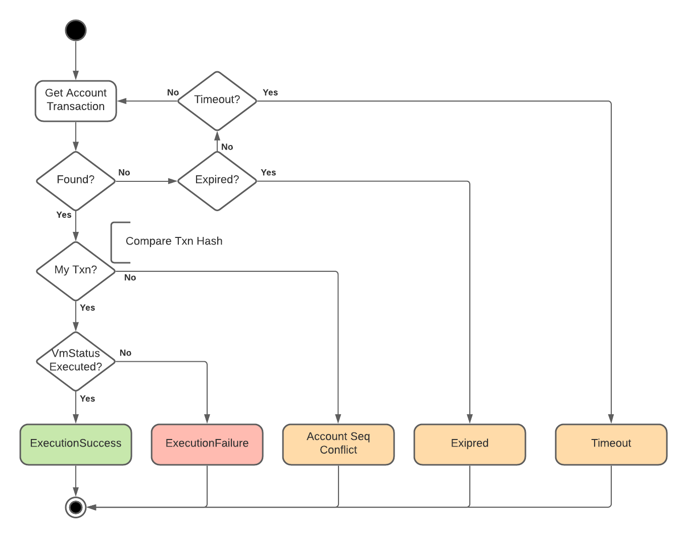

# JSON-RPC Client

JSON-RPC client connects to Diem JSON-RPC API for querying blockchain information and submitting transaction.

## JSON-RPC SPEC API

The client supports all APIs listed in [JSON-RPC API SPEC][1], and the response data types are properly deserialized.

You can use [jsonrpc.proto][3] to generate response data type code by [protobuf][4], then use protobuf json format parser to deserialize response types. The implementation various depending on the language; one caveat is protobuf json format parser does not support deserializing json array by default, you need handle it by yourself. See python or Java SDK client implementation for example.

## Get APIs should retry stale response error

A stale response error should be raised by a client if it founds the server response data is not newer than the version the client knows before making the request.

Blockchains in general are at best eventually consistent. That is a client reading from two servers could expect that one server is behind the other. Specifically, consider a read returns a version:

1. read(server) => 5
2. read(server) => 6
3. read(server) => 5

It is entirely possible in the case where there may be redundancy behind a single domain. And even more likely in our fault tolerance case of n upstreams choose one.

In any case, if we arrive at an older version:

1. We should capture the stale response error and retry with reasonable attampts.
2. The stale response error may hold a reference to the stale response object, so that caller can have an option to capture the stale response error and use the stale response.

All Diem JSON-RPC APIs response server latest ledger version by [http headers](https://github.com/diem/diem/blob/master/json-rpc/json-rpc-spec.md#http-response-headers-extensions) for client to know server ledger version and timestamp.

### Submit transaction API should ignore stale response error

Re-submit any transaction may get JsonRpcError `SEQUENCE_NUMBER_TOO_OLD` in multi-threads/concurrent environment, for example:

1. thread-1: submit transaction.
2. server: receive submit transaction. The latest ledger version is X.
3. server: receive a new state sync, latest ledger version becomes X+1.
4. thread-2: get_events (can be any get API).
5. server: receive get_events. The latest ledger version is X+1.
6. server: respond to get_events with latest ledger version == X+1.
7. thread-2: receive get_events response.
8. thread-2: update latest known ledger version X+1.
9. server: respond to submit transaction with latest ledger version == X.
10. thread-1: receive submit transaction response. Found response ledger version X < known version X+1.
11. thread-1: triggers StaleResponseError.
12. if we retry on StaleResponseError, the submitted transaction may end with JsonRpcError `SEQUENCE_NUMBER_TOO_OLD`
    if the following events happened.
13. server: execute transaction, and the transaction sender account sequence number +1.
14. thread-1: submit the transaction again.
15. server: validate transaction sender account sequence number, and response SEQUENCE_NUMBER_TOO_OLD error.
    However, the transaction was executed successfully, thus raising SEQUENCE_NUMBER_TOO_OLD error may cause
    a re-submit with new account sequence number if client handled it improperly (without checking whether
    the transaction is executed).

## Wait for transaction execution

Wait for transaction execution flow diagram:

For timeout and expiration error, may raise error message with sender account sequence number and transaction sequence number.
One of reasons causes the timeout and expiration is the transaction sequence number is bigger than sender account sequence number.

## Request strategy

Request strategy means the client has a way to plugin different strategies for sending requests to different server.

By default, the client may only accept one Diem full node server URL, and always send request by the given URL.

A strategy may plugin for fallback to one or multiple backup server URLs when the primary one call is failed.

Python SDK JSON-RPC client example:
* The client accepts a [diem.jsonrpc.client.RequestStrategy](https://diem.github.io/client-sdk-python/diem/jsonrpc/client.html#diem.jsonrpc.client.RequestStrategy) instance in constructor, and default to forward the request to the primary server URL.
* [diem.jsonrpc.client.RequestWithBackups](https://diem.github.io/client-sdk-python/diem/jsonrpc/client.html#diem.jsonrpc.client.RequestWithBackups)

## JSON-RPC Batch requests

Diem JSON-RPC API supports batch requests defined by [JSON-RPC SPECIFICATION][2].

For verifying client and some use cases, the batch requests maybe required for getting consistent data (same blockchain ledger version) from server.

## Off-chain resource query APIs

These are high level APIs nice to have for implementing [Diem off-chain API][5].

* `get_parent_vasp_account` by account address
* `get_base_url_and_compliance_key` by account address: Parent VASP and Designated Dealer accounts have `base_url` and `compliance_key` setup. If the given account address is a child VASP account, this function should return `base_url` and `compliance_key` from it's parent VASP account.

## Async IO

Provide [Asynchronous IO](https://en.wikipedia.org/wiki/Asynchronous_I/O) support.

## User-Agent HTTP Header

Client should send HTTP request with User-Agent HTTP header for server to recognize the client SDK name and version.

Syntax: `diem-client-sdk-<langauge> / <version>`

For example: `diem-client-sdk-java / 1.0.1`

[1]: https://github.com/diem/diem/blob/master/json-rpc/json-rpc-spec.md
[2]: https://www.jsonrpc.org/specification#batch
[3]: https://github.com/diem/diem/blob/master/json-rpc/types/src/proto/jsonrpc.proto
[4]: https://developers.google.com/protocol-buffers
[5]: https://dip.diem.com/dip-1
