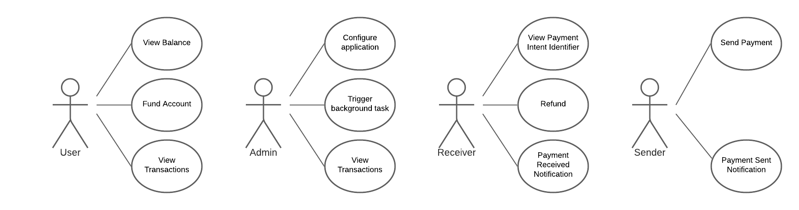

# Mini Wallet

Mini wallet is a highly simplified wallet application backend server that integrates with Diem Payment Network.

## Goals

1. Demostrates SDK primary features for integrating an application with Diem Payment Network.
2. Can play as counterparty wallet application for developing wallet application connects to Diem Payment Network.
3. Develop a standard test suite for testing cross-langauge SDKs primary features.

## Use Cases

