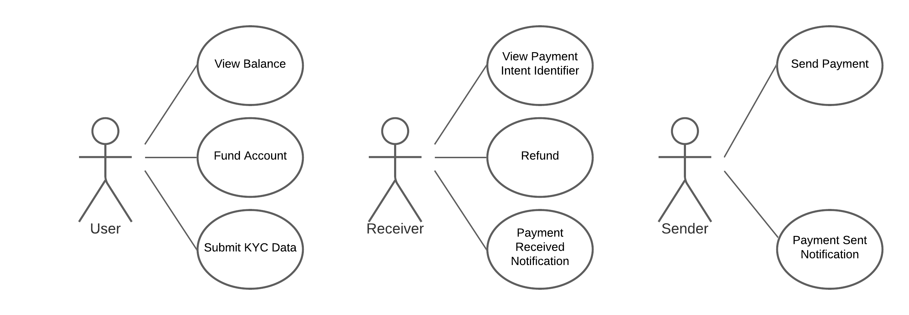

# Diem MiniWallet

MiniWallet is a highly simplified wallet application backend server that integrates with Diem Payment Network.

## Goals

1. Demonstrate SDK features for integrating an application with Diem Payment Network.
2. Play as counterparty wallet application for wallet applications CI builds, and develop a standard test suite for Diem wallet applications.
3. Develop a standard test suite for testing cross-language SDKs features.

## Use Cases

## API Specification

The MiniWallet API is organized around [REST], accepts JSON-encoded request bodies, returns JSON-encoded responses, and uses standard HTTP response codes and verbs.

We value simplicity in favor of performance in MiniWallet API design.

### Errors

MiniWallet responses 400 for client error, 404 for entity is not found,  and 500 for server internal error.

There is no requirement about the response body for errors; recommend human readable messages and stack traces for easy debugging.

### Endpoints

| Method | Path                            | Description                                                           |
|--------|---------------------------------|-----------------------------------------------------------------------|
| GET    | /accounts                       | Returns all accounts.                                                 |
| POST   | /accounts                       | Create a new account.                                                 |
| GET    | /accounts/:id/transactions      | Returns all account transactions.                                     |
| GET    | /accounts/:id/payments          | Returns all payments.                                                 |
| POST   | /accounts/:id/payments          | Create a payment that is paid by the account to a payee.              |
| POST   | /accounts/:id/receive_payment   | Generate and return a new [Account Identifier] for receiving payment. |
| GET    | /accounts/:id/commands          | Returns all account off-chain commands.                               |
| PUT    | /accounts/:id/commands/:id      | Update an account command by id. Invalid command should be accepted.  |
| POST   | /accounts/:id/commands/:id/sync | Make an outbound call to counterparty service off-chain API endpoint. |
| POST   | /offchain/v2/command            | Diem Off-chain API. Please refer to [DIP-1] for the API details.      |

> `POST /accounts/:id/receive_payment` returns the generated [Account Identifier] JSON-encoded string as the response body.

> For the case POST creates a new resource, server accepts the new resource JSON-encoded string as request body, then responses code 201 (Created) and a `Location` header field that provides the URL of the resource created.

> For the case PUT updates a resource successfully, server responses code 200 (Ok). Returning the updated resource as JSON is optional.

> Server should set `Content-Type` header value `application/json` for JSON responses.

> It is optional to accept a form-encoded request body.

### Resources

#### Account

Account is a record of payment activities and transactions.

| Attribute                  | Type   | Description                                                                                |
|----------------------------|--------|--------------------------------------------------------------------------------------------|
| id                         | string | Unique account id                                                                          |
| initial\_deposit\_currency | string | Diem currency code of the initial deposit.                                                 |
| initial\_deposit\_amount   | uint   | The amount of initial deposit.                                                             |
| kyc\_data                  | string | Data will be deserialized into JSON objects and set [PaymentActorObject] `kyc_data` field. |

> Set `kyc_data` value to a valid [KycDataObject] serialized JSON string for exchanging KYC Data successfully.

> Set `kyc_data` to an invalid [KycDataObject], like missing a required field, for testing error handlings of the counterparty service off-chain API.

> Use account `id` as `additional_kyc_data` if it is requested by the counterparty service.

#### Transaction

Transaction represents funds moving through a Mini Wallet account.

It is created when:

1. An [account](#account) creation request succeeds with above zero initial deposit amount.
2. A [payment](#payment) is sent or received successfully from Diem on-chain transaction.

> Execution failed Diem transactions should not be converted into transactions.

> Account balance is the sum amounts of the account transactions by currency. Account balance should not be less than zero.

> For one currency, the sum of all accounts' transaction amounts should not exceed the sum of all VASP on-chain account amounts.

| Attribute                  | Type   | Description                                                  |
|----------------------------|--------|--------------------------------------------------------------|
| id                         | string | Unique identifier                                            |
| currency                   | string | Diem currency code.                                          |
| amount                     | int    | Amount of the transaction, negative is debit to the account. |
| type                       | enum   | One of values: `payment`, `deposit`                          |
| diem\_transaction\_version | uint   | set if the transaction has an associated Diem transaction.   |
| payment\_id                | string | set if the transaction is from a payment.                    |

> Use int 128 if preallocate is required for the `amount` field.

#### Payment

Payment records an intent to send funds from an account to a payee.

| Attribute  | Type        | Description                              |
|------------|-------------|------------------------------------------|
| id         | string      | Unique identifier                        |
| currency   | string      | Diem currency code                       |
| amount     | uint        | Amount of the payment                    |
| payee      | string      | [Account Identifier], or [Diem ID].      |

#### Command

Command represents the Diem off-chain command object.

It is created when:
1. a payment requiring off-chain data exchange is created.
2. a valid off-chain command request is received from counterparty service.

| Attribute   | Type        | Description                                    |
|-------------|-------------|------------------------------------------------|
| id          | string      | Unique identifier                              |
| command     | string      | JSON-serialized Diem off-chain command object. |

> Field `id` is not the `cid` of the command object, because the command `cid` may be duplicated when testing invalid commands.
> Field `command` is a JSON string, because we should accept invalid off-chain command objects, thus the field structure is unknown.
> For decoded `command` object definitions, please refer to the related DIP document.

[REST]: https://en.wikipedia.org/wiki/Representational_state_transfer
[DIP-1]: https://dip.diem.com/dip-1
[Account Identifier]: https://dip.diem.com/dip-5/#account-identifiers
[Diem ID]: https://dip.diem.com/dip-10
[KYC Data]: https://en.wikipedia.org/wiki/Know_your_customer
[KycDataObject]: https://dip.diem.com/dip-1/#kycdataobject
[PaymentActorObject]: https://dip.diem.com/dip-1/#paymentactorobject
